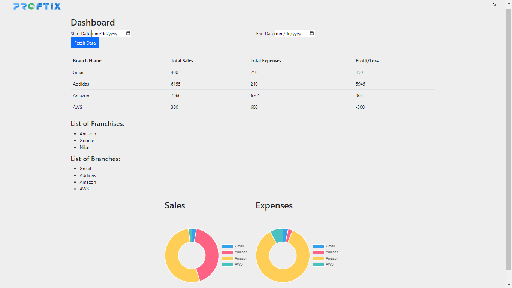
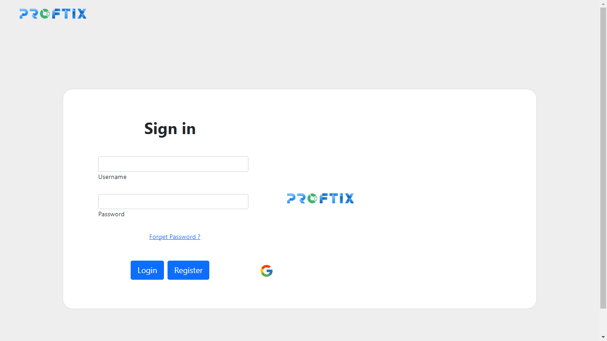
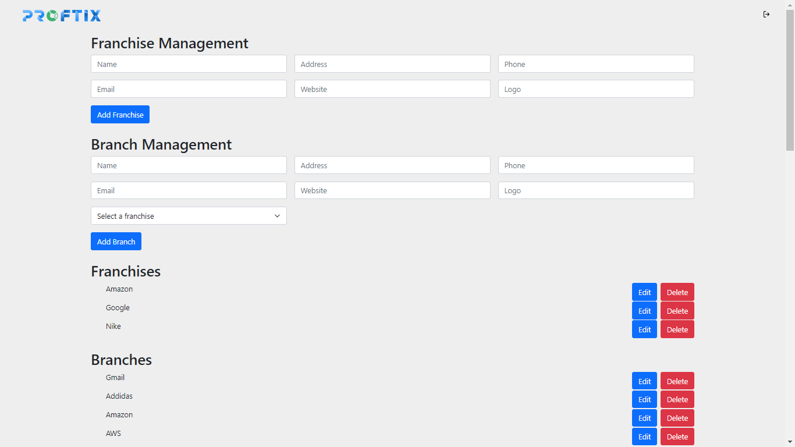
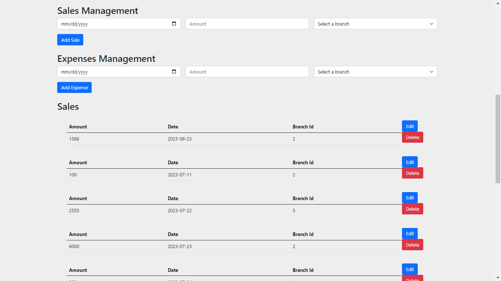

# Proftix - Financial Matrix Dashboard

## Proftix is a powerful financial dashboard that combines "profit" and "matrix" to offer a comprehensive view of your financial data, empowering you to make smart decisions and maximize profits. With its modern interface and user-friendly features, Proftix simplifies, visualizes, and optimizes your finances, making it the pathway to financial success.

### Figma Link
<link>https://www.figma.com/file/deSfof1H124tE6hu5rd3Oj/Proftix?type=whiteboard&t=DEKR7G2pF7frm1gb-6 </link>

### Dashbord Page

### Sign In Page 

### Admin Page 
 

### Table of Contents
1. #### Introduction
2. ####  Features
3. #### Getting Started
4. #### Prerequisites
5. #### Installation
6. #### Usage
7. #### Authentication
8. #### Dashboard
9. #### Franchises and Branches
10. #### Financial Data
11. #### Charts
12. #### Technologies Used
13. #### Contributing
14. #### License

1. ### Introduction
Proftix is a comprehensive financial data dashboard that helps you visualize and manage your expenses and sales, enabling smart financial decisions. The name "Proftix" is a combination of "profit" and "matrix," emphasizing its focus on maximizing profits and providing a clear view of your financial data.

2. ###  Features
User-friendly authentication with login, sign-up, email verification, and Google login options.
Reset password functionality with email verification.
Centralized dashboard to monitor financial data.
Ability to manage franchises and branches.
Detailed financial reports, including total sales, total expenses, and profit/loss.
Interactive charts for better data visualization.
3. ### Getting Started
Prerequisites
Node.js and npm should be installed on your system.
Backend API should be set up with a database to store financial data.
Installation
Clone the repository to your local machine:

git bash
Copy code git clone https://git.generalassemb.ly/mohd96/Proftix.git
Navigate to the project directory:

bash
Copy code
cd proftix
Install the required dependencies:

Copy code
npm install
Set up environment variables:

Rename the .env.example file to .env and fill in the required configurations, such as database credentials, API URLs, and secret keys.
Run the development server:

sql
Copy code
npm start
Access the application in your web browser at http://localhost:3000.

4. ### Usage
Authentication
Use the login and sign-up options to access the dashboard securely.
Verify your email address during sign-up or password reset using the email verification feature.
Quickly log in with your Google account using the Google login option.
Dashboard
The centralized dashboard displays an overview of financial data for franchises and branches.
View the total sales, total expenses, and profit/loss for each branch.
Franchises and Branches
Manage franchises and their respective branches within the application.
Add new franchises and branches or edit existing ones.
Financial Data
View detailed financial reports for each branch.
Check individual branch sales, expenses, and profit/loss records.
Charts
Utilize interactive charts to visualize financial data.
Pie charts show the distribution of sales and expenses among branches.
5. ### Technologies Used
Frontend: React, React Router, React ChartJS
Backend: Python, dJango, postgreSQL
Authentication: JWT, dj_rest_auth, Google OAuth
Email Verification: Nodemailer
Data Visualization: Chart.js, React-chartjs-2, Nivo Bar Chart
6. ### Contributing
Contributions to Proftix are welcome! If you have any bug fixes, improvements, or new features to add, please open an issue or create a pull request. We appreciate your support!

7. ### License
Proftix is open-source software licensed under the MIT License.
Thank you for choosing Proftix! We hope this financial dashboard helps you achieve your financial goals and brings success to your business. If you have any questions or need assistance, please don't hesitate to contact us. Happy financial management with Proftix!